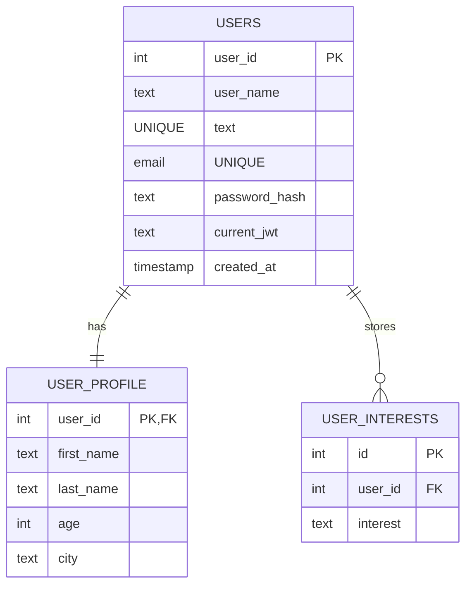

# ER Diagram (LearnixAI)

- `USERS` хранит логин, email, хэш пароля и текущий JWT токен.
- `USER_PROFILE` хранит личные данные пользователя.
- `USER_INTERESTS` хранит список интересов (по одной записи на интерес).
